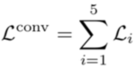
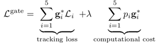

# Depth Adaptive Visual Tracking
First ever open source Implementation of Computation Adaptive Siamese network for Visual Tracking
## Introduction

The following is an Unofficial implementation of [Depth-Adaptive Computational Policies for Efficient Visual Tracking](https://arxiv.org/pdf/1801.00508.pdf) by Chris Ying and Katerina Fragkiadaki. 

The folllowing topics are covered by my project:
- [x] **Data-Preprocessing**. Key and Search frame extraction from Imagenet 2017 VID dataset
- [x] **Intermediate Supervision VGG Model**. Built using Intermediate Supervision as mentioned in Paper.
- [x] **Budgeted Gating Loss**. Implemented the g* function mentioned in Paper with Shallow Feature Extractor.
- [x] **Hard Gating for Evaluation**. Hard gating which stops the computation when confidence score exceeds threshold.
- [x] **Readability**. The code is very clear,well documented and consistent.

<pre>Search Frame&nbsp;&nbsp                                                   Cross Correlation Frame</pre>

<pre>                               </pre>


## Model Keys
 **Model Structure**
 
- [x] Build Key & Search Inputs
- [x] Build Vgg Nets for each 
- [x] Build 5 Blocks of Cross-Corr & Flops for each
- [x] Build Non-Diff Shallow Feature Extractor from Cross-Corr
- [x] Build Confidence Score ~ Gfunction
- [x] Build Intermediate Supervision Block Loss
- [x] Build Budgeted Gates & Gate Loss
- [x] Build Hard Gates for Evaluation 

**Block Loss is implemented in model/compAdaptiveSiam/block_loss().This loss also results in exploding Gradients for which to prevent there is L2 Regularization and Gradient Clipping Implemented** 




**Budgeted Gates implemented in model/compAdaptiveSiam/gStarFunc()**


**Gate Loss implemented in model/compAdaptiveSiam/gateLoss**



**Cropped Section of TensorBoard Graph**


## Prerequisite
The main requirements can be installed by:
```bash
pip install -r requirements.txt

``` 

## Data Collection and Preprocessing

One can download the ImageNet Vid dataset from the [link](http://bvisionweb1.cs.unc.edu/ILSVRC2017/download-videos-1p39.php)

The data can be preprocessed to Key frame & Search frame using the following code

*Change the location of the dataset from main function in the file* 
```bash
python scripts/preprocess_VID_data.py
```
Finally data can be split into train and validation and pickled by the following code

```bash
python scripts/build_VID2015_imdb.py
```
The credit for the scripts to preprocess the Visual Tracking DataSet goes to [Huazhong University of Science and Technology](https://github.com/bilylee/SiamFC-TensorFlow)

## Training
It will iteratively train the Vgg Weights using Intermediate Supervison and then use the weights to 
train the Gated Weights.
This process will happen iteratively
```bash

python main.py train

```

## Evaluation
Hard Gating will  stop the computation when the confidence score exceeds the threshold
It will return the Cross Correlation Map,Flops Computed and the index of the block where computation stopped

```bash

python main.py eval

```

## Pretrained Model
If you are training from beginning then use the vgg pretrained model provided here [link](https://mega.nz/#!xZ8glS6J!MAnE91ND_WyfZ_8mvkuSa2YcA7q-1ehfSm-Q1fxOvvs)


The pretrained model for VggNet and Gates trained by me is [here]()
